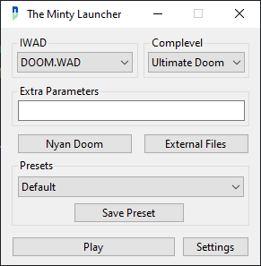
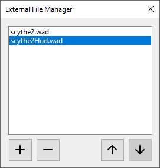

<div align="center">
    
    <h1>Minty Launcher</h1>
</div>

# About Minty Launcher
Minty Launcher focuses mainly on user usability and simplicity. The interface is built to be quickly readable and quick to go through.
The launcher also has Discord Rich Presence support so people can see what you're playing and what source port you're using.

Minty Launcher only targets Windows, and only has been tested on Windows 10 and 11. Wine support is mostly untested.

## Useful Links
* [Downloads](https://github.com/PENGUINCODER1/Minty-Launcher/releases)
* [User's Guide](MANUAL.MD)
* [MIT License](LICENSE.MD)

## Interface
<details>
	<summary>Main Window</summary>
	
</details>

<details>
	<summary>External File Manager Window</summary>
	
</details>

# Downloading
You can get Win64 and Win32 bins (both Framework-Dependent and Standalone) [here on the repo](https://github.com/PENGUINCODER1/Minty-Launcher/releases). 

If you use the Framework-Dependent version, you'll need to have the .NET 9 Desktop Runtimes installed. You can get them [here](https://dotnet.microsoft.com/en-us/download/dotnet/9.0).

You should also read the user manual, found at `MANUAL.MD`. Use the one that came with your download and use a markdown reader for the most accurate manual to your version.

# Building
## Prerequisites
* [.NET 9 SDK](https://dotnet.microsoft.com/en-us/download/dotnet/9.0)
* [DiscordRichPresence](https://github.com/Lachee/discord-rpc-csharp) (will usually download when building)

## Building Steps
Clone the repo:
```
git clone https://github.com/CoderPenguin1-dev/Minty-Launcher.git
```

Move into build directory:
```
cd "Minty-Launcher/Doom Loader"
```

Build & Run Debug binary:
```
dotnet run
```

It should open up afterwards. The build will be in `Doom Loader\bin\Debug\net9.0-windows7.0`.

### Optionally change the Discord Application ID
```
cd Properties
notepad Resources.resx
```

Scroll all the way down and edit the number under `<data name="DiscordAPI" xml:space="preserve">` with your Application ID.
Save and close Notepad.
```
cd ..
```