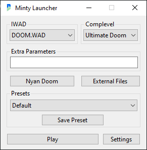

# Minty Launcher
A C# WinForms Doom launcher I made as I hadn't liked others like ZDL or Doom Launcher.
This is built for my purposes and features will usually be added when I need/want them. I will, however, gladly take suggestions and implement them if possible within my ability.

Minty Launcher focuses mainly on user usability and simplicity. Everything you need is visibly shown, but there's more specific features and shortcuts when you need them.
The launcher also has Discord Rich Presence support so people can see what you're playing and what source port you're using.

Minty Launcher only targets Windows, and only has been tested on Windows 10 and 11. Minty Launcher through Wine has mainly been untested.

**NOTICE** Versions of Minty Launcher are receiving false positives. Details in this commit: https://github.com/PENGUINCODER1/Minty-Launcher/issues/2

**NOTICE** The license for Minty Launcher starting v5.4.1 has been changed over to the MIT License.

## Useful Links
* [Downloads](https://github.com/PENGUINCODER1/Minty-Launcher/releases)
* [User's Guide](MANUAL.MD)
* [MIT License](LICENSE.MD)

Although not required, I do ask you not to sell forks of Minty Launcher or to restrict access to the source code.

## Interface
<details>
	<summary>Main Window</summary>
	
	<p>Using the Port Database to show "Nyan Doom" instead of "nyan-doom"</p>
</details>

<details>
	<summary>External File Manager Window</summary>
	
</details>

# Downloading
You can also get Win64 and Win32 bins (both Framework-Dependent and Standalone) as well as the premade port database file [here on the repo](https://github.com/PENGUINCODER1/Minty-Launcher/releases). 

If you use the Framework-Dependent version, you'll need to have the .NET 9 Runtimes installed. You can get there [here](https://dotnet.microsoft.com/en-us/download/dotnet/9.0).

Note that there's a user manual you should read, titled `MANUAL.MD`.

# Building
## Prerequisites
* [.NET 9 SDK](https://dotnet.microsoft.com/en-us/download/dotnet/9.0)
* [DiscordRichPresence](https://github.com/Lachee/discord-rpc-csharp) (will usually download when building)

## Building Steps
Clone the repo:
```
git clone https://github.com/PENGUINCODER1/Minty-Launcher.git
```

Move into build directory:
```
cd "Minty-Launcher/Doom Loader"
```

Optionally change Discord RPC API Key:
```
cd Properties
notepad Resources.resx
```
Scroll all the way down and edit the number under `<data name="DiscordAPI" xml:space="preserve">` with your API key.
Save and close Notepad.
```
cd ..
```

Build & Run Debug binary:
```
dotnet run
```

It should open up afterwards. The build will be in `Doom Loader\bin\Debug\net9.0-windows7.0`.